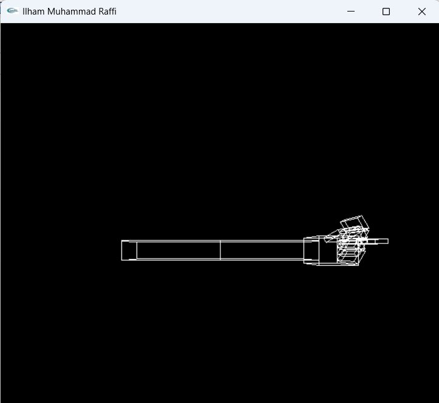

# PENUGASAN PRAKTIKUM GTI PERTEMUAN 3

## NAMA: Ilham Muhammad Raffi

## NIM: 24060124140198

## LAB: A2

Pada praktikum kali ini, kita ditugaskan untuk membuat sebuah model tangan yang dapat digerakkan. Tangan tersebut terdiri dari jari, telapak, serta bagian lengan, di mana seluruh bagiannya dapat dikontrol menggunakan keyboard.

Untuk menggerakkannya, terdapat dua cara, yaitu secara manual dengan mengontrol setiap bagian secara langsung, serta menggunakan preset pose atau gaya yang telah ditentukan.

## Pose Tangan
- 1 = Menunjuk
- 2 = Genggam

## Manual
- s/S = Shoulder
- e/E = Elbow
- p/P = Palm
- f/F = Finger
- g/G = Fingertip

## SCREENSHOT
1. MENUNJUK

   

